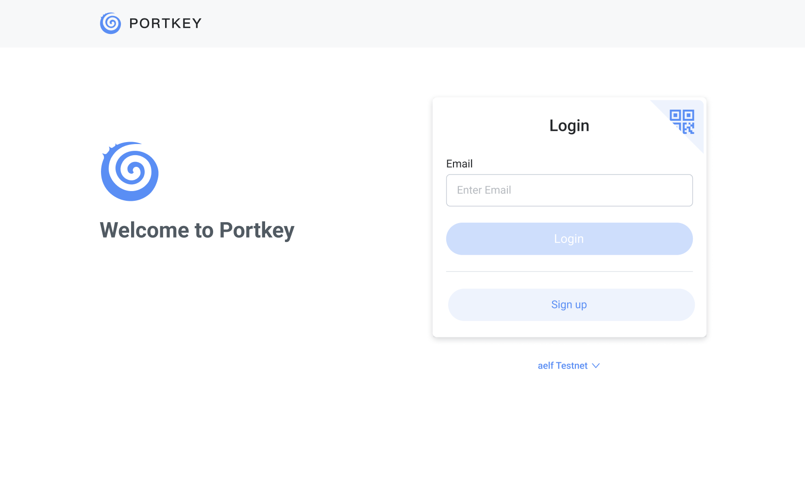
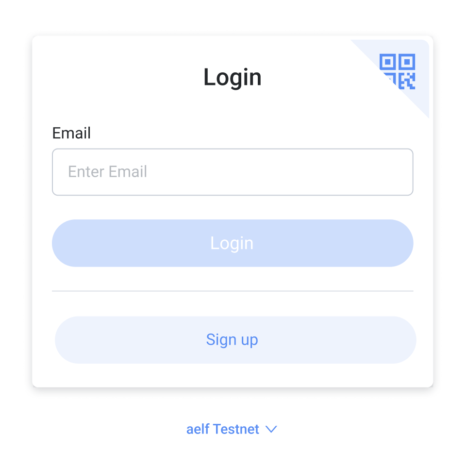
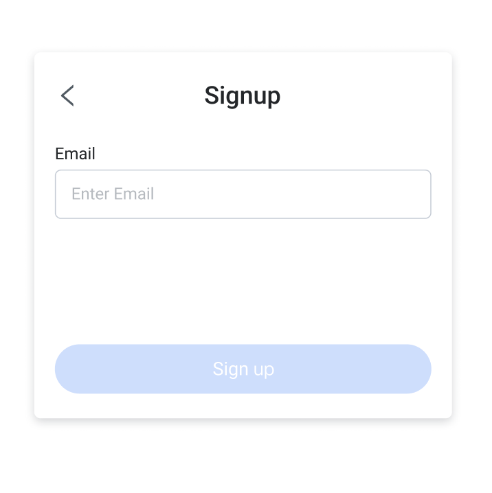
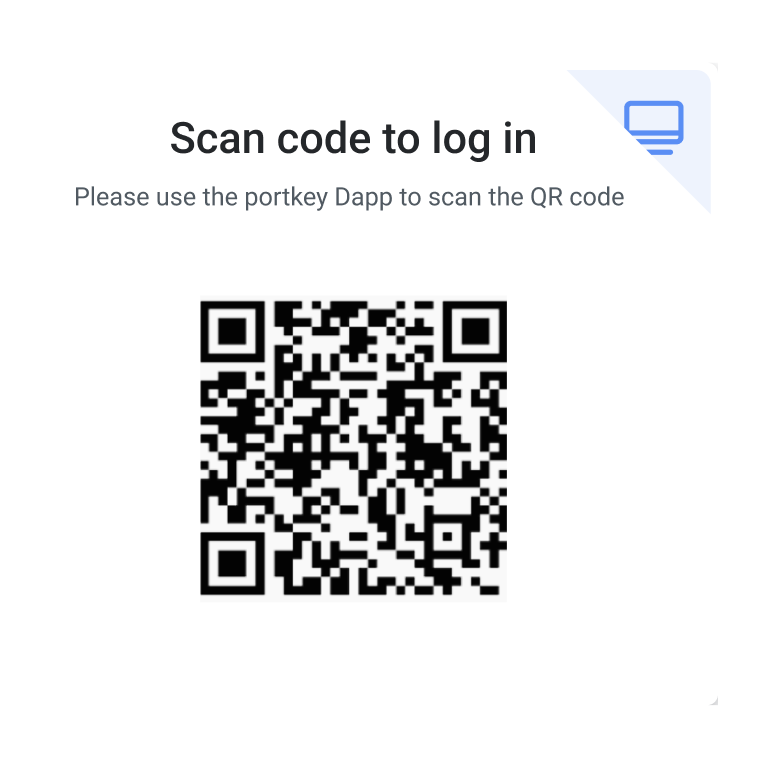
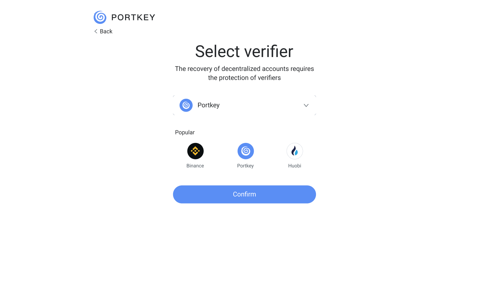
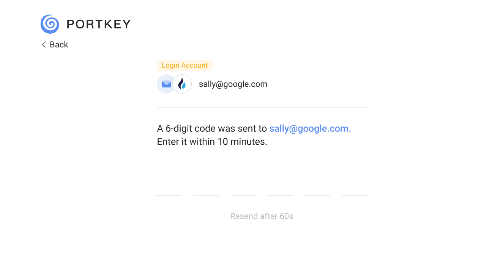
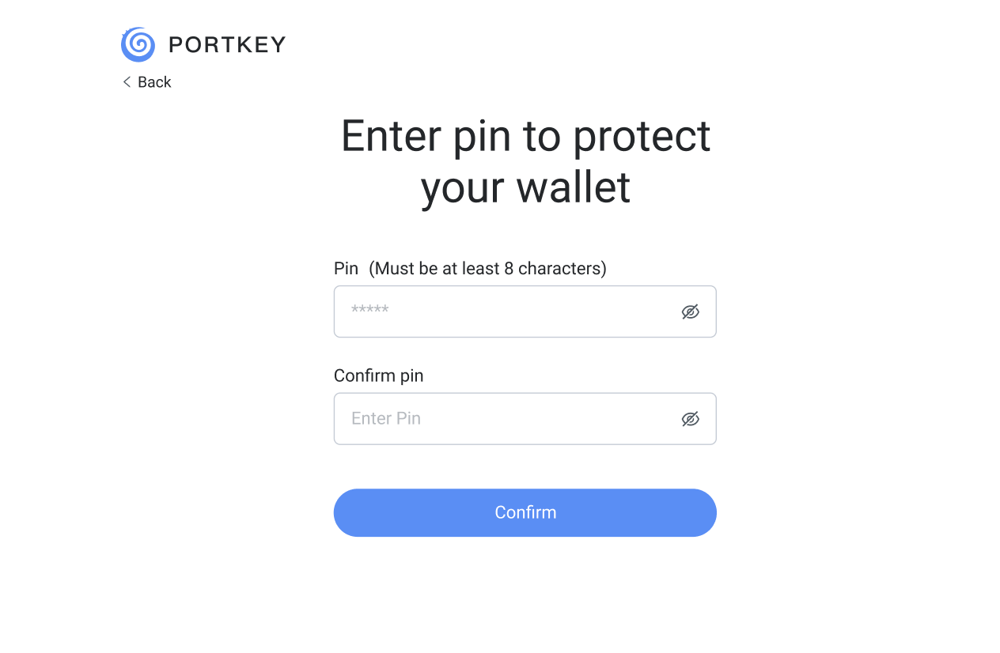
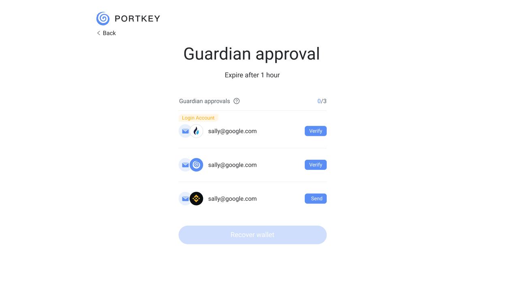
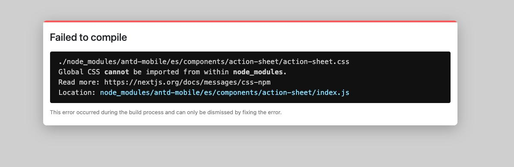
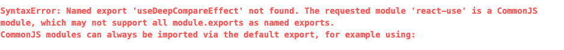

# Portkey DID UI SDK

[](https://npmjs.org/package/@portkey/did-ui-react) 

## Typescript

### Getting started

#### Installation

Using `@portkey/did-ui-react`

```bash
npm install "@portkey/did-ui-react
```

```bash
yarn add "@portkey/did-ui-react
```

#### Quick Start

```javascript
import {
  SignIn,
  PortkeyProvider,
  SignInInterface,
} from "@portkey/did-ui-react";
import { useRef } from "react";
import "@portkey/did-ui-react/dist/assets/index.css";

const App = () => {
  const ref = useRef<SignInInterface>();

  return (
    <PortkeyProvider networkType="TESTNET">
      <button onClick={() => ref.current?.setOpen(true)}>Sign In</button>
      <SignIn ref={ref} />
    </PortkeyProvider>
  );
};

export default App;
```

Configure your web server to proxy requests from `/api` to `https://did-portkey-test.portkey.finance` (for TESTNET).

### Customize

#### Customize configuration

```javascript
import { ConfigProvider } from '@portkey/did-ui-react';
import { IConfig } from '@portkey/types';
// Global Configuration
ConfigProvider.setGlobalConfig({
  // If you want to support "scan to log in" feature or you have multiple networks like testnet and mainnet, please configure the network
  network: {
    networkList?: NetworkItem[];
    /**
    * NetworkItem['networkType'];
    */
    defaultNetwork?: string;
  };
  // Configure @portkey/did (see @portkey/did for details) [Click here to jump to @portkey/did docs]
   ...props: IConfig;
});
```

#### Customize request

If you use it on websites, please configure the cross-domain proxy;
If you use it on applications that don't require cross-domain, like Chrome extensions, please configure your provider address using `ConfigProvider.setGlobalConfig`:

```javascript
ConfigProvider.setGlobalConfig({
  requestDefaults: {
    baseURL: "http://localhost:3000",
  },
  graphQLUrl: "http://localhost:3000/graphQL",
});
```

#### Customize storage

If you need to customize persistent storage, the default storage is `localStorage`:

```javascript
export interface IStorageSuite {
  getItem: (key: string) => Promise<any>;
  setItem: (key: string, value: string) => Promise<any>;
  removeItem: (key: string) => Promise<any>;
}

ConfigProvider.setGlobalConfig({
  storageMethod: IStorageSuite,
});
```

### Guides

#### All in one

This shows as a pop-up

```javascript
import { SignIn } from "@portkey/did-ui-react";
// Introduces public CSS files
import "@portkey/did-ui-react/dist/assets/index.css";

const App: React.FC = () => <Signin open={open} onFinish={onFinish} />;

export default App;
```

The whole process of "sign up and log in" is based on `antd Modal` and presented as pop-ups; `open` is used to control visibility.

```javascript
export interface SignInProps {
  // Modal config
  open?: boolean;
  className?: string;

  chainId?: ChainId;
  accountType?: AccountType;
  sandboxId?: string; // The current platform is chrome extension, 'sandboxId' is  required
  // antd message is used by default. It can be turned off.
  isErrorTip?: boolean;
  isShowScan?: boolean; // Is "scan to log in" supported. If global network is configured, the default value is based on whether network is configured.
  loginInputValidator?: (value?: string) => Promise<any>;
  getContainer?: ModalProps["getContainer"];
  // When you click Modal mask, the callback onCancel will be triggered
  onCancel?: () => void;
  // When there is an internal interface error or operation error, onError will be triggered
  onError?: OnErrorFunc;
  onNetworkChange?: (network: string) => void;
  // When sign-up or social recovery is completed, onFinish will be triggered
  onFinish?: (didWallet: DIDWalletInfo) => void;
  // Lifecycle of sign-up and social recovery
  onLifeCycleChange?: (liftCycle: LifeCycleType) => void;
}
```



#### Individual UI modules

The 5 modules include:

- SignUpAndLogin
- SelectVerifier
- CodeVerify
- SetPinAndAddManager
- GuardianApproval with UI
  Take SignUpAndLogin, for example. Please refer to the specific input parameters for the rest components.

```javascript
import { SignUpAndLogin } from "@portkey/did-ui-react";
import "@portkey/did-ui-react/dist/assets/index.css";

export interface SignUpAndLoginProps {
  type?: CreateWalletType;
  chainId?: ChainId;
  className?: string;
  isErrorTip?: boolean;
  isShowScan?: boolean;
  onError?: OnErrorFunc;
  inputValidator?: (value?: string) => Promise<any>;
  onSignTypeChange?: (type: CreateWalletType) => void;
  onSuccess?: (value: string) => void;
  onFinish?: (walletInfo: DIDWalletInfo) => void;
  onNetworkChange?: (network: string) => void;
}

const App: React.FC = () => <SignUpAndLogin {...props} />;

export default App;
```

```javascript
export { default as SignUpAndLogin } from "./SignUpAndLogin";
export { default as SignUpBase } from "./SignUpBase";
export { default as ScanCard } from "./ScanBase";
export { default as ConfigProvider } from "./config-provider";
export { default as SelectVerifier } from "./SelectVerifier";
export { default as CodeVerify } from "./CodeVerify";
export { default as SetPinAndAddManager } from "./SetPinAndAddManager";
export { default as GuardianList } from "./GuardianList";
export { default as GuardianApproval } from "./GuardianApproval";
export { default as SignIn } from "./SignIn";
```

##### 1. Login panel

The panel contains login, scan to log in, and sign-up functions. You can implement sign-up and login interfaces.

**LoginCard**



**SignUpBase**



**ScanCard**



1. Input parameters:

```javascript
export type CreateWalletType = "SignUp" | "Login" | "LoginByScan";

export interface SignUpAndLoginProps {
  type?: CreateWalletType;
  chainId?: ChainId;
  className?: string;
  isErrorTip?: boolean;
  isShowScan?: boolean;
  onError?: OnErrorFunc;
  inputValidator?: (value?: string) => Promise<any>;
  onSignTypeChange?: (type: CreateWalletType) => void;
  onSuccess?: (value: string) => void;
  onFinish?: (walletInfo: DIDWalletInfo) => void;
  onNetworkChange?: (network: string) => void;
}

<SignUpAndLogin {...SignUpAndLoginProps} />;
```

2. Enter the info and click "Confirm" to verify.
3. Return the output:

- "Sign-up and login" returns info to be entered in the dialogue box;
- "Scan to log in" returns DID wallet info.

##### 2. Select verifier

```javascript
// As it is for Chrome extensions, contract can only be called in sandbox instead of inside the component. Hence, the verifierList should be passed from outside.

export interface VerifierSelectProps {
    chainId?: ChainId;
    verifierList?: VerifierItem[];
    defaultVerifier?: string;
    guardianIdentifier: string;
    className?: string;
    accountType?: AccountType;
    isErrorTip?: boolean;
    onError?: OnErrorFunc;
    onConfirm?: (result: {
        verifier: VerifierItem;
        verifierSessionId: string;
    }) => void;
/>

```



1. Select the drop-down menu or click ICON to select.
2. Click "Confirm" and the result will be returned.

##### 3. Verify code

```javascript
export interface CodeVerifyProps {
  chainId: ChainId;
  verifier: VerifierItem;
  className?: string;
  accountType?: AccountType;
  isCountdownNow?: boolean;
  isLoginAccount?: boolean;
  guardianIdentifier: string;
  verifierSessionId: string;
  isErrorTip?: boolean;
  onError?: OnErrorFunc;
  onSuccess?: (res: {
    verificationDoc: string,
    signature: string,
    verifierId: string,
  }) => void;
  onReSend?: (result: {
    verifier: VerifierItem,
    verifierSessionId: string,
  }) => void;
}

<CodeVerify
  className="content-padding"
  guardianIdentifier={guardianIdentifier}
  verifier={sendCodeInfo.verifier}
  loginType={loginType}
  isCountdownNow={true}
  isLoginAccount={true}
  verifierSessionId={sendCodeInfo.verifierSessionId}
  onSuccess={onCodeVerifySuccess}
/>;
```



1. Enter code to verify
2. Click "Resend"
3. Return the verification info

##### 4. Set pin and add management account

```javascript
export interface SetPinAndAddManagerProps {
  className?: string;
  accountType?: AccountType;
  chainId?: ChainId;
  guardianIdentifier: string;
  verificationType: VerificationType;
  walletName?: string;
  guardianApprovedList: GuardiansApproved[];
  isErrorTip?: boolean;
  onError?: OnErrorFunc;
  onFinish?: (values: DIDWalletInfo) => void;
}

<SetPinAndAddManager
  chainId={chainId}
  accountType={accountType}
  guardianIdentifier={guardianIdentifier}
  verificationType={verificationType}
  guardianApprovedList={guardianApprovedList}
  onFinish={onFinish}
/>;
```



##### 5. Guardian approval (for login only)

```javascript
export interface GuardianApprovalProps {
  header?: ReactNode;
  chainId: ChainId;
  className?: string;
  guardianList?: BaseGuardianItem[];
  isErrorTip?: boolean;
  onError?: OnErrorFunc;
  onConfirm?: (guardianList: GuardiansApproved[]) => void;
}

<GuardianApproval
  accountType={"Email"}
  guardianList={guardianList}
  onConfirm={onFinish}
/>;
```



### FAQ

#### Nextjs

1. If it's used on websites, please pay attention to the cross-domain issues and configure the proxy first.
2. If an error occurs, please follow:





```javascript
// https://mobile.ant.design/zh/guide/ssr

// next.config.js

// Next.js V12
const withTM = require('next-transpile-modules')(['antd-mobile'， '@portkey/did-ui-react']);
module.exports = withTM({
  // Other Next.js configuration in your project
});


// Next.js V13
const nextConfig = {
  experimental: {
    transpilePackages: ['antd-mobile', '@portkey/did-ui-react']);Ï
  },
};

module.exports = nextConfig;

```

#### Chrome extension

3. Configure sandbox separately
   Access the encapsulated js files from [GitHub](https://github.com/Portkey-Wallet/portkey-wallet/tree/feature/react-did-ui) and add them to your sandbox.
